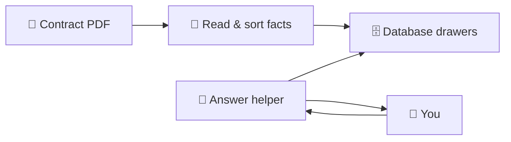

# DECISIONS.md

## Schema design

**`contract_terms`** holds pricing-grid terms only: admin fees, network discounts, dispensing fees, and rebates. Dimensions disambiguate overlaps: `pricing_model_id` (Traditional vs Applied Rebates), `network_id`, `drug_type`, `channel`, `calendar_year`, `payment_schedule`.

**`included_services`** holds document-level services from two PDF sections:

- `(Included Services)` — bullets with `source_section='included_services'`, `is_included=true`
- `Allowances and Ancillary Charges` — priced fee schedule with `source_section='allowances_fees'`, `fee_type` (`allowance` / `ancillary_fee`), and value fields (`value_type`, `value_text`, `basis_type`, etc.)

Fee schedule data is pricing-model agnostic (no `pricing_model_id`, `network_id`, or year columns), so it does not belong in `contract_terms`. Sub-headings such as "Additional Administrative Services" are stored in `category` for filtering and audit.

Migration `004_extend_included_services.sql` moved legacy `allowance` / `ancillary_fee` rows out of `contract_terms` into `included_services` and tightened the `term_category` check to grid terms only.

Why a unified row shape for values:

- The PDF mixes units ($/claim, PMPM, AWP-%, flat annual). `basis_type`, `value_type`, and `value_text` preserve meaning without schema churn.
- A second vendor PDF becomes a new `documents` row with the same tables — no code changes.

Non-numeric values use `value_type` (`included`, `quoted_upon_request`, `pass_through`) plus verbatim `value_text`, not NULL sentinels.

Rebate payment timing is a first-class field (`payment_schedule`, `payment_timing_text`) because two otherwise identical rebate grids differ only by quarterly vs monthly payment.

**Reference tables** (`networks`, `pricing_models`) are seeded minimally in migration `001` and upserted from extraction at load time. Migration `003` removed the vendor-specific `northwind_direct_specialty` seed so new vendors are not tied to sample-PDF network names.

## Raw document storage

**`documents.raw_markdown`** stores the full PDF as markdown at extraction time via [Markitdown](https://github.com/microsoft/markitdown). Added in migration `002`; dropped unused `raw_metadata` and `extraction_metadata` JSONB columns.

Why markdown:

- Human-readable audit copy alongside structured rows
- Single artifact used as LLM extraction input, validator corpus, and DB storage
- No binary PDF blob in Postgres

Re-running extraction for the same `source_filename` replaces the document row and its `raw_markdown`.

## Extraction pipeline

**Markitdown + LLM-first structured extraction**, with a deterministic rule supplement for the fee schedule and a `--no-llm` fallback.

```text
PDF → Markitdown → markdown
  → (default) OpenAI structured output → ContractTermRow / IncludedServiceRow / AssumptionRow
  → rule parser supplements Allowances and Ancillary Charges → included_services
  → validator (source-text checks) → Supabase
  → (--no-llm) format-generic section split → rule parsers for all sections
```

### Reproducibility (Task 1)

The graded pipeline is a single CLI: `poetry run writewise-extract --pdf <path>`. Vendor names, client names, dollar amounts, and percentages are read from the document at runtime — nothing in `src/` hardcodes Northwind/Brightline figures. A second same-format proposal becomes a new `documents` row; reference tables (`networks`, `pricing_models`) are upserted from extracted data.

### Hybrid extraction: what each layer does

| Section | Extractor | Why |
|---------|-----------|-----|
| Traditional / Applied Rebates grids, rebates, admin fees | LLM structured output | Multi-column year/network grids; vendor network names vary |
| (Included Services) bullets | LLM structured output | Unstructured bullet lists under category headings |
| Allowances and Ancillary Charges | Rule parser (`parse_fee_schedule`) | See below |
| Assumptions and Caveats | LLM structured output | Free-text bullets |

### Why supplement fees with a rule parser

Testing showed the LLM-only path reliably extracted ~20 `(Included Services)` bullets but **zero** rows from Allowances and Ancillary Charges (including the Additional Administrative Services table), even with explicit prompt instructions. That section has ~30+ priced rows with mixed layouts (inline costs, multi-line cells, "Included", "Quoted upon request").

The hybrid fix (`_supplement_services_from_rules` in `pipeline.py`) keeps LLM output for grids and included bullets, then always rule-parses the `Allowances and Ancillary Charges` markdown section into `included_services` with `source_section='allowances_fees'`. This is a reliability fix for a measured failure mode, not a schema workaround.

The rule parser reads **values from the markdown** via `parse_single_value`; it does not embed contract dollar amounts. It does assume **same document format**: section title `Allowances and Ancillary Charges` and known sub-headings (e.g. `Additional Administrative Services`, `Implementation Allowances`). That matches the assignment's "second document in the same format" constraint.

Why Markitdown over pdfplumber or Docling:

- **Markitdown** — lightweight, one-step PDF→markdown, good enough for same-format proposals; easy Poetry install for graders
- **Not pdfplumber** — required vendor-specific section regex and brittle column mapping; markdown was generated but unused for extraction
- **Not Docling** — better table fidelity but heavy models/RAM; overkill for this assessment scope

Why LLM-first for pricing grids:

- Removes vendor-specific hardcoding (no `Northwind` / `Brightline` regex, no fixed `section_title` mappers)
- Reads network names, formulary names, and section headings from the document
- `networks` and `pricing_models` reference rows are upserted at load time from extracted data

Trustworthiness:

1. **Structured outputs** — Pydantic schema with enums constrains `term_category`, `basis_type`, `value_type`, etc.
2. **Source-text validation** — drops numeric rows whose values don't appear in the markdown corpus
3. **Idempotent loads** — re-run deletes prior rows for the same `source_filename`
4. **Provenance columns** — `section_title`, `page_number`, `source_row_label` (grids); `category`, `service_name`, `value_text` (fees)

**`--no-llm` fallback** — rule parsers on all markdown sections (format-generic headers, generic metadata heuristics). Best-effort offline path; less accurate for pricing grids on new vendors. Graders should use default LLM extraction for the second PDF.

## Evaluation (`src/eval/`)

Automated extraction quality checks ship with the repo — not just a future stretch goal.

```text
evaluate_extraction(pdf)
  → extract (optionally --no-llm)
  → validate_extraction (pre/post row counts)
  → golden spot checks (metadata, key terms, key fees)
  → threshold checks (min row counts, max drop rates)
  → verify_numerics_in_source (every numeric row in raw_markdown)
```

- **CLI:** `writewise-eval --pdf <path> [--no-llm] [--json] [--golden <path>] [--skip-numeric-verify]`
- **Golden fixture:** `tests/fixtures/northwind_expected.json` — spot values (e.g. Retail 90 generic 2027, clinical PA $95) plus thresholds (`min_terms_out`, `max_terms_drop_rate`, etc.)
- **Tests:** `tests/eval/` (unit), `tests/integration/` and `tests/eval/test_eval_sample_pdf.py` (live sample PDF)

`--no-llm` is the default for CI-style runs because it avoids OpenAI cost and is deterministic enough for regression on the sample PDF.

## Tool design

**Typed tools, not a generic SQL tool.**

| Tool | Role |
|------|------|
| `list_documents` | List extracted contracts; disambiguation when multiple documents exist |
| `list_pricing_models` / `list_networks` | Disambiguation |
| `get_network_discount` | Discounts and dispensing fees |
| `get_rebate_guarantee` | Rebate $ + payment timing |
| `search_fees` | Allowances & ancillary charges keyword search (`included_services` where `source_section='allowances_fees'`) |
| `get_included_services` | Included services + related fees from same table |
| `get_assumptions` | Caveats text |

Typed tools constrain query shapes, prevent bad joins across pricing models, and return structured `needs_clarification` responses when parameters are missing.

**Document scoping:** `get_network_discount`, `get_rebate_guarantee`, `search_fees`, `get_included_services`, and `get_assumptions` accept `document_id`. The CLI agent selects a contract at session start and injects `document_id` when the LLM omits it. Tools return `needs_clarification` with document options when `document_id` is missing and multiple contracts exist.

**Retail 30/90 discount lookup:** Extraction may store Broad National grid columns as `network_id=broad_national` + `channel=retail_30|retail_90`, or as `network_id=retail_30|retail_90` with `channel` null. `_resolve_discount_location` maps user-facing `network` / `channel` args to DB filters; queries try `channel` first, then fall back to `network_id` for the same slug.

## Question routing

**Hybrid approach: context-first inference, tool-driven clarification.**

Do not ask upfront questions like "Is this a service?" — users speak in contract terms, not database tables. Infer the tool from question wording; clarify only when dimensions are missing or the database returns multiple valid matches.

| User signal | Tool | Clarify when |
|-------------|------|--------------|
| "how much", "cost", "fee for" + service name | `search_fees` | Multiple fee rows match (e.g. $65 vs $95 prior auth) |
| "discount", "dispensing fee" + network/year | `get_network_discount` | Missing pricing model, network, drug type, or year |
| "rebate" + channel/year | `get_rebate_guarantee` | Missing payment schedule, channel, or year |
| "included", "extra-cost", "included vs" | `get_included_services` | Topic appears in both included and priced sections |
| "assumption", "caveat" | `get_assumptions` | Category unclear (optional) |

README example questions → tools:

| Question | Tool |
|----------|------|
| What's the generic discount for Retail 90 in 2026? | `get_network_discount` |
| How much is a clinical prior authorization with physician review? | `search_fees` |
| What's the specialty rebate per brand drug in 2027, and when is it paid? | `get_rebate_guarantee` |
| What's included vs. extra-cost in eligibility maintenance? | `get_included_services` |

`search_fees` uses strict token matching first, then a scored suggestion fallback on Supabase rows when no exact match is found (partial token overlap — rows are not required to match every query word). Multiple candidates return `needs_clarification` with `service_name` and `value_text` options from the database. Natural-language mismatches (e.g. "with" vs em-dash in a service name) trigger clarification, not silent `not_found`.

Prior authorization nuance: operational/admin PA is listed under included services; clinical PA fees ($65 standard, $95 with physician review) are in allowances_fees. "How much" routes to `search_fees`; if the query matches multiple fee rows, the agent asks the user to choose from tool-provided options before stating a price.

## Grounding

1. System prompt forbids inventing numbers; answers must cite tool results.
2. Tools return verbatim `value_text` from the database.
3. Ambiguous questions (e.g. "brand discount" without network/year/model) trigger clarification via `needs_clarification` tool responses — the agent must not silently pick Traditional over Applied Rebates.
4. **Agent-loop hardening** (`agent.py`):
   - If the user has not said Traditional or Applied Rebates, unsolicited `pricing_model` args are stripped before `get_network_discount` runs.
   - Drug type, calendar year, and Retail 30/90 channel are inferred from prior user messages and injected when the LLM omits them (rule 6a in the system prompt).
5. `not_found` responses are passed through; the agent says data is missing rather than guessing.

## What broke / limitations

- **LLM fee schedule omission** — single-pass LLM extraction missed the entire Allowances and Ancillary Charges section; hybrid rule supplement addresses this
- **LLM grid accuracy** — pricing/rebate tables may mis-assign network or year columns; validator catches missing numerics but not all structural errors
- **Markitdown table layout** — dense multi-column grids may flatten; Docling would be the upgrade path
- **Fee schedule line breaks** — multi-line cells sometimes split into separate rows; search still finds related fees
- **Format coupling** — fee rule parser expects same section/sub-heading names as the sample proposal; renamed sections in a "same format" doc would need parser updates
- **Validator** — lenient on `value_text` substring checks for AWP strings; strict on numeric presence in source
- **`--no-llm` fallback** — uses format-specific metric headers and column heuristics throughout
- **Multi-document sessions** — agent selects one contract at startup; switching mid-session requires explicit `list_documents` / re-selection

## Architecture (simple view)

Think of the system like a library for one big pricing book:

```text
  YOU                         READING ROBOT              FILING CABINET           ANSWER HELPER
  ---                         -------------              --------------           -------------

  "Here's a PDF"  ───────►   Turns pages into notes  ──►  Sorts facts into      Only looks in the
  (contract book)              and pulls out numbers       labeled drawers          drawers — never
                             (Markitdown + LLM +            (Supabase tables)        makes up prices
                              rule parser)                                         

  "What's the fee            ───────────────────────────────────────────────────►  Finds the right
   for prior auth?"                                                                  drawer, reads
                                                                                     the label, talks
                                                                                     back to you
```

**Step by step (like a story):**

1. **The book** — A PBM sends a PDF pricing proposal (discounts, fees, rebates).
2. **The reading robot** — Markitdown turns the PDF into plain text. OpenAI reads that text and fills out structured forms (rows in the database). A small rule-based helper double-checks the fee table because the robot sometimes skips that chapter.
3. **The filing cabinet** — Supabase stores every fact in drawers: discounts, fees, included services, assumptions. Each contract gets its own folder.
4. **The answer helper** — When you ask a question, a second OpenAI call picks the right drawer tools, looks up real numbers, and answers. It is not allowed to peek at the PDF or guess.



## Tradeoffs and why

| Decision | Chosen | Alternative | Why we chose it | What we gave up |
|----------|--------|-------------|-----------------|-----------------|
| Extraction engine | LLM structured output (default) | Full rule-based parsers | Pricing grids vary by vendor; rules would hardcode Northwind/Brightline column layouts | Per-PDF API cost; occasional column mis-assignments |
| Fee schedule | Hybrid: LLM + `parse_fee_schedule` rules | LLM only | Measured failure: LLM extracted 0 fee rows from Allowances and Ancillary Charges | Fee parser tied to same section headings as sample format |
| PDF → text | Markitdown | Docling / pdfplumber | One dependency, fast setup, good enough for same-format proposals | Weaker table fidelity on dense multi-column grids |
| Q&A interface | Typed Supabase tools | Generic SQL or RAG over PDF | Prevents wrong joins (e.g. Traditional vs Applied Rebates), returns `needs_clarification` | New question types need a new tool, not ad-hoc SQL |
| Storage | Supabase Postgres | Self-hosted DB / warehouse | Free tier, migrations via CLI, no ops for assessment scope | Less control over scaling and networking |
| Grounding | DB-only answers + validator | Agent reads PDF directly | Numbers always trace to extracted rows; validator drops hallucinated numerics | Cannot answer questions about text never extracted |
| Agent UX | CLI + document picker | Web UI | Fast to ship; fits assessment; easy to demo | No visual contract compare or click-to-cite |
| Eval / CI | `--no-llm` + golden JSON | LLM-in-the-loop tests every run | Deterministic, no API spend in pytest | Offline path is less accurate than production LLM path |
| Multi-document | Session `document_id` injection | Global search across all contracts | Avoids mixing two vendors' discounts in one answer | Switching contracts mid-chat needs `list_documents` |

**Theme:** optimize for **trustworthy answers on same-format PBM PDFs**, not for parsing every possible contract layout in the wild without human review.

## Cost implications

Rough operating costs for this assessment-scale deployment (single team, dozens of PDFs per month, not enterprise volume).

| Component | When it runs | Typical cost | Notes |
|-----------|--------------|--------------|-------|
| **OpenAI extraction** | Once per PDF (`writewise-extract`) | ~$0.05–$0.25 per 10-page proposal on `gpt-4o` | One structured-output call over full markdown; largest input token bill |
| **OpenAI Q&A** | Per user question (`writewise-agent`) | ~$0.01–$0.05 per question | 1–3 tool rounds common; cap of 8 rounds per question |
| **Markitdown** | Bundled with extraction | $0 | Local conversion, no API |
| **Supabase** | Always on | $0 on free tier | Fits assessment + small pilot; paid tiers if row/storage limits hit |
| **Rule parsers / validator** | Every extraction | $0 | CPU-only |
| **CI / tests** | `pytest`, `writewise-eval --no-llm` | $0 API | Avoids OpenAI in automated runs |

**Cost controls built in:**

- `--no-llm` and `--dry-run` for extraction without API or DB writes
- `temperature=0` on all LLM calls (more deterministic, fewer retries)
- Validator drops bad rows instead of re-prompting the LLM (no extract-retry loops)
- Golden eval uses offline extraction for regression tests

**If volume grows 10×:** extraction cost scales linearly with PDF count; Q&A scales with questions. Upgrade paths: cache markdown per `source_filename`, batch extractions off-peak, smaller model for Q&A tool routing only, or Docling only where Markitdown fails (adds infra, not API).

## Impact and ROI

**Problem today (without this system):** pharmacy benefit analysts and account managers hunt through 10+ page PDFs for one number — generic discount for Retail 90 in 2027, clinical prior auth fee, rebate payment timing. Wrong network or pricing model silently changes dollars at stake.

| Metric | Manual PDF search | This system | Direction |
|--------|-------------------|-------------|-----------|
| Time to answer a factual pricing question | 5–20 minutes | ~30 seconds (after extraction) | Large reduction |
| Risk of citing wrong pricing model | High (two parallel grids) | Lower — tools require dimensions or clarify | Risk reduction |
| Onboarding second same-format vendor | Re-read PDF / new spreadsheets | Re-run extract CLI | Reusable pipeline |
| Audit trail | Page flipping | `value_text`, `source_row_label`, `raw_markdown` | Better provenance |
| Regression when prompts/parsers change | Manual re-check | `writewise-eval` + golden JSON | Automated guardrail |

**ROI framing (illustrative, not a customer quote):**

- If an analyst costs **$50/hour** and saves **10 minutes per lookup**, each grounded answer saves **~$8** before counting error avoidance.
- One **avoided pricing error** on a mid-size book of business can exceed **months** of API + Supabase cost.
- **Break-even** for API spend is typically a handful of lookups per extracted contract per month — extraction is amortized across all future questions on that document.

**Who benefits:**

- **Analysts / AMs** — fast, cited answers during client calls
- **Implementation** — structured rows for downstream systems instead of copy-paste
- **Engineering** — golden tests catch extraction drift before users see bad data

**What ROI does not claim yet:** fully hands-off extraction on arbitrary vendor layouts, or dollar-impact modeling (rebate guarantees × volume) — those are listed under "With more time."

## With more time

- Stretch eval Q&A pairs + automated agent answer grading against golden questions
- Docling for improved table fidelity if Markitdown layout is insufficient
- Rebate dollar estimation tool (claims × rebate rate × AWP assumptions)
- Human-in-the-loop review UI for extraction warnings
- pgvector search for assumptions/caveats free-text questions

---

A Word-friendly summary of this document is available as **`WriteWise_Decisions.docx`** in the project root.
